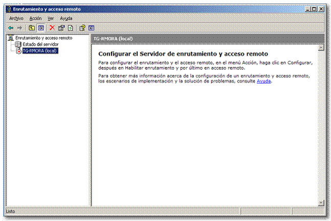
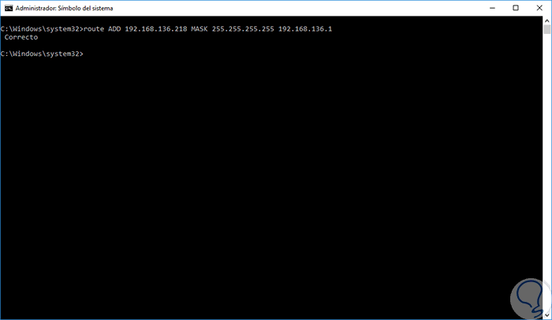
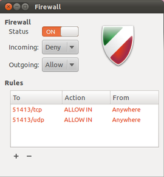
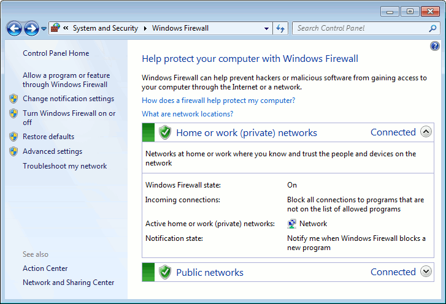
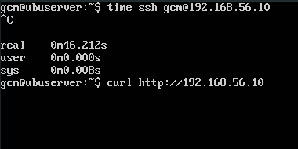
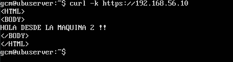
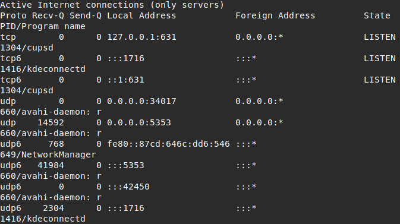

## Tema 3

### Ejercicio 3.1
*Buscar con qué órdenes de terminal o herramientas gráficas
podemos configurar bajo Windows y bajo Linux el
enrutamiento del tráfico de un servidor para pasar el
tráfico desde una subred a otra.*

En Linux existe **iptables** y el comando **route** para conseguir el enrutamiento de redes. Para activar el enrutamiento:

`sudo echo "1" > /proc/sys/net/ipv4/ip_forward
iptables -A FORWARD -j ACCEPT
iptables -t nat -A POSTROUTING -s 10.0.0.0/8 -o eth0 -j MASQUERADE`

Si queremos enrutar hacia una red:

`//Crear una ruta para una red concreta
sudo route add -net 193.144.238.0/24 eth1`

En Windows existe la herramienta gráfica **Enrutamiento y acceso remoto**



Aunque nos permite añadir rutas a traves de CMD:

` route ADD Red de destino MASK mascara de subred  Gateway o Puerta de enlace Métrica`




### Ejercicio 3.2

*Buscar con qué órdenes de terminal o herramientas gráficas
podemos configurar bajo Windows y bajo Linux el filtrado
y bloqueo de paquetes.*

En Linux existe el firewall **iptables** como hemos visto en la asignatura. También existe el cortafuegos **ufw** con la interfaz gráfica **gufw**.



En Windows encontramos el firewall del sistema.



Aunque existen numerosas opciones de terceros para manejar el firewall. En el siguiente enlace muestran los 10 mejores en la actualidad. [https://www.lifewire.com/free-firewall-programs-4129270](https://www.lifewire.com/free-firewall-programs-4129270)

## Tema 4

### Ejercicio 4.6 
*Buscar información sobre los bloques de IP para los distintos
países o continentes.*

En las siguientes páginas podemos ver el rango de IPs disponibles para cada país.

[https://lite.ip2location.com/ip-address-ranges-by-country](https://lite.ip2location.com/ip-address-ranges-by-country)

[https://www.nirsoft.net/countryip/](https://www.nirsoft.net/countryip/)

*Implementar en JavaScript o PHP la detección de la zona
desde donde se conecta un usuario*

Puesto que existe una biblioteca en PHP que funciona correctamente no es necesario programarla. [http://chir.ag/projects/geoiploc/](http://chir.ag/projects/geoiploc/)

El script principal es el siguiente:
```php
<?php
error_reporting(E_ALL & ~E_NOTICE);
include("geoiploc.php"); 
  if (empty($_POST['checkip']))
  {
	$ip = $_SERVER["REMOTE_ADDR"]; 
  }
  else
  {
	$ip = $_POST['checkip']; 
  }
?> 
Tu dirección IP es: <?php echo($ip); ?> <br>
Tu País es : <?php echo(getCountryFromIP($ip, " NamE"));?>
 (<?php echo(getCountryFromIP($ip, "code"));?>)
```

## Tema 6

### Ejercicio 6.1
*Aplicar con iptables una política de denegar todo el tráfico
en una de las máquinas de prácticas.
Comprobar el funcionamiento.*

```
# (1) Eliminar todas las reglas (configuración limpia)
iptables -F
iptables -X
iptables -Z
iptables -t nat -F
# (2) Política por defecto: denegar todo el tráfico
iptables -P INPUT DROP
iptables -P OUTPUT DROP
iptables -P FORWARD DROP
```



*Aplicar con iptables una política de permitir todo el tráfico
en una de las máquinas de prácticas.
Comprobar el funcionamiento.*

```
# (1) Eliminar todas las reglas (configuración limpia)
iptables -F
iptables -X
iptables -Z
iptables -t nat -F
# (2) Aceptar todo el tráfico
iptables -P INPUT ACCEPT
iptables -P OUTPUT ACCEPT
iptables -P FORWARD ACCEPT
```




### Ejercicio 6.2
*Comprobar qué puertos tienen abiertos nuestras máquinas,
su estado, y qué programa o demonio lo ocupa.*

`netstat -tulpn`




## Tema 7

### Ejercicio 7.1 
*¿Qué tamaño de unidad de unidad RAID se obtendrá al
configurar un RAID 0 a partir de dos discos de 100 GB y
100 GB?*

100 GB / 3 unidades = 33GB por unidad

*¿Qué tamaño de unidad de unidad RAID se obtendrá al
configurar un RAID 0 a partir de tres discos de 200 GB
cada uno?*

200 GB / 3 unidades = 66GB por unidad

### Ejercicio 7.2
*¿Qué tamaño de unidad de unidad RAID se obtendrá al
configurar un RAID 1 a partir de dos discos de 100 GB y
100 GB?*

100 GB / 3 unidades = 33GB por unidad

*¿Qué tamaño de unidad de unidad RAID se obtendrá al
configurar un RAID 1 a partir de tres discos de 200 GB
cada uno?*

200 GB / 3 unidades = 66GB por unidad