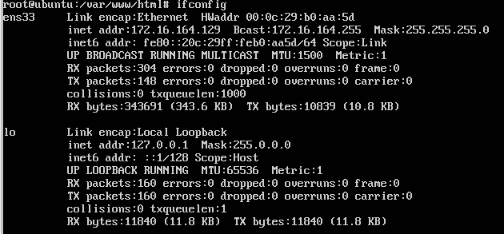
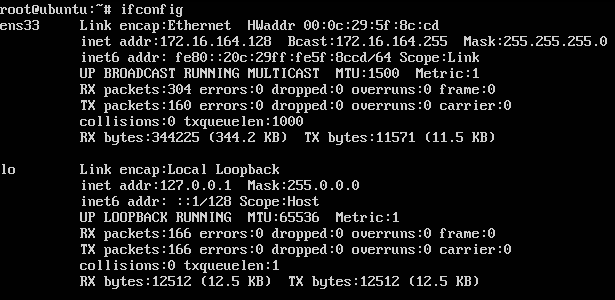

# Practica 1: Preparación de las herramientas

 
*En esta práctica el objetivo es configurar las máquinas virtuales para trabajar en
prácticas posteriores, asegurando la conectividad entre dichas máquinas.
Como resultado de la práctica 1 se mostrarán dos máquinas funcionando al
profesor en clase (accesos con curl para solicitar páginas web sencillas, así como el
acceso por SSH entre ambas máquinas).
Específicamente, hay que llevar a cabo las siguientes tareas:*
1. *acceder por ssh de una máquina a otra*
2. *acceder mediante la herramienta curl desde una máquina a la otra*

-------

En mi caso he decidido emplear **VMWare Workstation** para la realización de las prácticas. La instalación de Ubuntu Server ha sido realizada como se indica en el guión. 

El primer paso para poder conectar ambas máquinas es conocer la IP mediante
`ifconfig`

### IP de la primera máquina

### IP de la segunda máquina
