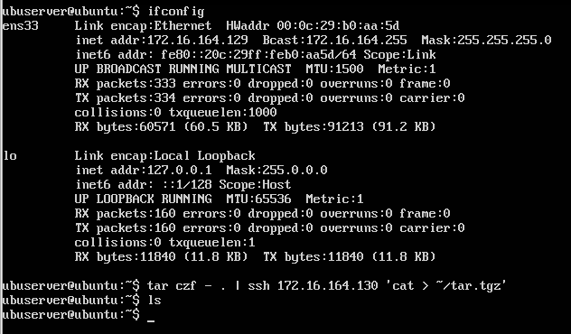

# Práctica 2: Clonar la información de un sitio web

*En esta práctica el objetivo es configurar las máquinas virtuales para trabajar en modo
espejo, consiguiendo que una máquina secundaria mantenga siempre actualizada la
información que hay en la máquina servidora principal.
Hay que llevar a cabo las siguientes tareas:*
1. *probar el funcionamiento de la copia de archivos por ssh*
2. *clonado de una carpeta entre las dos máquinas*
3. *configuración de ssh para acceder sin que solicite contraseña*
4. *establecer una tarea en cron que se ejecute cada hora para mantener actualizado el contenido del directorio /var/www entre las dos máquinas*

----

## Copia de archivos por SSH

La solución que se mostrará a continuación es útil para la copia de algún archivo puntual o para crear directamente un archivo en nuestro servidor a través de ssh. En este caso se comprimirá la carpeta actual (home) en la máquina 1 y será enviada a la máquina 2 

**Maquina 1**

**Maquina 2**

El método descrito no es el más recomendado, es preferible emplear rsync.

-------
## Instalar la herramienta rsync

El primer paso, previo a la copia, es establecer como dueño del directorio web al usuario sin privilegios (en mi caso 'ubuserver') en ambas máquinas: `sudo chown ubuserver:ubuserver –R /var/www`

Para comprobar el funcionamiento de rsync borraré el contenido de un directorio de la máquina 2 y lo clonaré de la máquina 1. Para realizarlo se debe emplear el siguiente comando `rsync -avz -e ssh user@ip:/dir/original /dir/clonado/` donde:
* **a**  modo archivos.
* **v**  verbose, información extra.
* **z**  comprime el archivo para su envío.
* **e**  especifica la shell remota

En mi caso debo emplear el siguiente comando:
`rsync -avz -e ssh ubuserver@172.16.164.129:/var/www/ /var/www/`

En el guión nos indican que podemos pasar más argumentos a rsync como **--exclude** para excluir directorios o **--delete** para eliminar los archivos en la máquina origen.
`rsync -avz --delete --exclude=**/stats --exclude=**/error --exclude=**/files/pictures -e ssh maquina1:/var/www/ /var/www/`

----

## Acceso sin contraseña para SSH

Cada vez que realizamos una conexión por ssh debemos indicar la contraseña del usuario, lo cual es contraproducente y tedioso si necesitamos hacerlo varias veces. Para solucionarlo, utilizaremos autentificación mediante un par de claves pública-privada.

El primer paso es **generar las claves mediante ssh-keygen**:
`ssh-keygen -b 4096 -t rsa`

A continuación ejecutamos ssh-copy-id para copiar la clave de nuestro ordenador al servidor al que queremos conectar sin contraseña.
`ssh-copy-id <ip-servidor>`

También podemos ejecutar comandos directamente sin hacer login:
`ssh <ip-servidor> <comando>`

*Nota: * En un primer momento he tenido problemas a la hora de conectar por ssh. El problema era que el firewall de la máquina estaba activado y no permitía las conexiones. Basta con permitir ssh para solucionarlo:
`ufw allow ssh`

------
## Programar tareas con crontab

Gracias a crontab se pueden programar tareas para ser realizadas automáticamente en un momento determinado. En nuestro caso, se debe establecer una tarea en cron para mantener actualizado el contenido de /var/www entre las dos máquinas.

Antes de realizar las tareas, debemos identificar el servidor principal y el servidor secundario. En mi caso estableceré como **máquina principal la 172.16.164.129** y como **máquina secundaria la 172.16.164.130**. Por lo tanto, la tarea de backup debe ser ejecutada en la máquina secundaria.

Esta tarea debe ser realizada cada 2 horas, por lo que debemos añadir a crontab :
`0 */2 * * * rsync -avz -e ssh 172.16.164.129:/var/www/ /var/www/`

Como se puede comprobar en la siguiente imagen, la tarea se ejecuta correctamente.

----
[Práctica 3](../practica3/practica3.md)