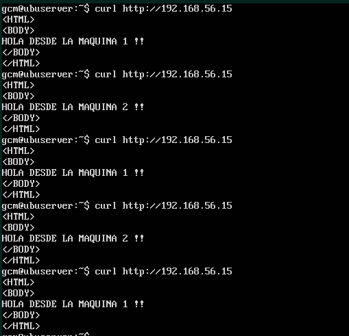

# Práctica 3: Balanceo de carga

*En esta práctica el objetivo es configurar las máquinas virtuales de forma que dos
hagan de servidores web finales mientras que la tercera haga de balanceador de
carga por software.*
*En esta práctica se llevarán a cabo, como mínimo, las siguientes tareas:*
1. *configurar una máquina e instalar el nginx como balanceador de carga2. configurar una máquina e instalar el haproxy como balanceador de carga*
2. *someter a la granja web a una alta carga, generada con la herramienta Apache
Benchmark, teniendo primero nginx y después haproxy.*
*En las tareas 1 y 2 debemos hacer peticiones a la dirección IP del balanceador y
comprobar que realmente se reparte la carga. Para ello, el index.html en las
máquinas finales deben ser diferentes para ver cómo las respuestas que recibimos al
hacer varias peticiones son diferentes (eso indicará que el balanceador deriva tráfico a
las máquinas servidoras finales).
Además, se comprobará el funcionamiento de los algoritmos de balanceo round-robin
y con ponderación (en este caso supondremos que la máquina 1 tiene el doble de
capacidad que la máquina 2).
En la tarea 3 debemos usar la herramienta ab para someter a una carga muy alta
(gran número de peticiones y con alta concurrencia) a la granja web, primero estando
nginx como balanceador, y a continuación estando haproxy como balanceador. Como
resultado, se debe realizar una comparación de los tiempos medios de servicio entre
ambos balanceadores, para poder determinar cuál funciona mejor.
Adicionalmente, y como tarea opcional para conseguir una mayor nota en esta
práctica, se propone el uso de algún otro software de balanceo diferente a los dos
explicados en este guión (por ejemplo Pound).*

----

**Nota: ** Debido a la reinstalación del sistema host y posterior instalación de las máquinas virtuales en virtualbox (anteriormente estaban en VMware), las configuraciones de estas VMs han cambiado. A partir de este momento las IPs serán:
- **192.168.56.11** como **principal** 
- **192.168.56.10** como **respaldo**
- **192.168.56.15** como  balanceador **nginx**
- **192.168.65.16** como balanceador **haproxy**
- **192.168.65.17** como balanceador **pound**
- **192.168.56.100** como **cliente externo**

----
## Nginx

El primer paso es **instalar nginx y activar el servicio**:
`sudo apt install nginx`
`sudo systemctl enable nginx && sudo systemctl start nginx`

Para comprobar que está escuchando y funcionando, se realiza el mismo procedimiento que con Apache. `ps aux | grep nginx` devolverá si el servicio está escuchando.


En el guión de prácticas se indica como realizar la configuración de nginx, pero tras la realización no funcionaba. Por lo tanto empleé el tutorial mostrado en [DigitalOcean](https://www.digitalocean.com/community/tutorials/how-to-set-up-nginx-load-balancing).

**Nota:**Cada vez que se edite el archivo de configuración de nginx se debe reiniciar el servicio con  `sudo systemctl restart nginx`

El archivo a editar se encuentra en la ruta *sudo nano /etc/nginx/sites-available/default*. En mi caso he realizado algunas modificaciones en el archivo, no lo he borrado.
Primero he añadido los servidores finales: 
```
upstream backend  {
  server 192.168.56.11;
  server 192.168.56.10;
}
```

También se debe buscar la línea `try_files $uri $uri/ =404;` y sustituirla por `proxy_pass  http://backend;`

Aquí se muestra el correcto funcionamiento del balanceador de carga empleando **round-robin** por defecto.


Con la anterior configuración, se accederá el mismo número de veces a una máquina que otra. Si imaginamos que la máquina 1 tiene el doble de capacidad, nos interesará que esta atienda el doble de peticiones. Aplicar esta configuración es muy sencillo ya que existe la directiva **weight** que permite indicar proporciones de tráfico.

```
upstream backend  {
    server 192.168.56.11 weight=2;  #máquina 1
    server 192.168.56.10 weight=1;  #máquina 2
}
```
En la siguiente imagen se muestra el correcto funcionamiento de la ponderación:


Cuando recibimos varias peticiones de la misma dirección IP puede resultar muy útil redirigirlas al mismo servidor web. Para ello se puede añadir la directiva `ip_hash;`. 
Pero si todos los usuarios están detrás de proxy o de un NAT, el balanceo no será equilibrado, por lo que otra solución es mantener abiertas la conexión durante algunos segundos (en mi caso no lo he hecho para ilustrar los ejemplos).
```
upstream backend  {
    server 192.168.56.11 weight=2;  #máquina 1
    server 192.168.56.10 weight=1;  #máquina 2
    keepalive 3;
}
```
-----
## Haproxy

Para **instalar y activar** haproxy:
`sudo apt install haproxy`
`sudo systemctl enable haproxy && sudo systemctl start haproxy`

En el guión de prácticas se indica como realizar la configuración de haproxy, pero tras la realización no funcionaba correctamente. Siguiendo distintos tutoriales, he conseguido que funcione de la forma esperada. 

**Nota:**Cada vez que se edite el archivo de configuración de haproxy se debe reiniciar el servicio con  `sudo systemctl restart haproxy`

El archivo de configuración de haproxy se encuentra en */etc/haproxy/haproxy.cfg*. Se debe sustituir el contenido del archivo por lo siguiente:

```
global
    log 127.0.0.1 local0
    chroot /var/lib/haproxy
    stats socket /var/lib/haproxy/stats level admin
    pidfile /var/run/haproxy.pid
    stats timeout 30s
    daemon
    maxconn 4000
    tune.ssl.default-dh-param 2048
    
defaults
    log global
    option dontlognull
    option redispatch
    timeout connect 5s
    timeout client 5s
    timeout server 10s
    
frontend http
    bind *:80
    mode http
    default_backend web-backend
    
backend web-backend
    balance roundrobin
    mode http
    server m1 192.168.65.11:80 check
    server m2 192.168.65.10:80 check
```

En mi caso, también he editado **haproxy.service**(*/etc/systemd/system/multi-user.target.wants/haproxy.service*)  quedando así:


Volvemos a cargar el servicio con `systemctl restart haproxy`. Si has modificado **haproxy.service**, antes debes ejecutar `systemctl reload-daemon`

Haproxy funciona correctamente empleando el algoritmo de reparto de carga Round-Robin


A continuación queremos que, como sucedió anteriormente, la máquina 1 sea sometida al doble de carga que la dos. De forma parecida a nginx, podemos emplear la directiva **weight** en el archivo de configuración de haproxy:

```
    ...
    backend web-backend
      balance roundrobin
      mode http
      server m1 192.168.65.11:80 check weight 100
      server m2 192.168.65.10:80 check weight 50
```

En este caso, el peso viene representado por un valor entre 0 y 255. En la documentación oficial se encuentra este párrafo donde se explica como funciona:
*weight <weight>
  The "weight" parameter is used to adjust the server's weight relative to
  other servers. All servers will receive a load proportional to their weight
  relative to the sum of all weights, so the higher the weight, the higher the
  load. The default weight is 1, and the maximal value is 256. A value of 0
  means the server will not participate in load-balancing but will still accept
  persistent connections. If this parameter is used to distribute the load
  according to server's capacity, it is recommended to start with values which
  can both grow and shrink, for instance between 10 and 100 to leave enough
  room above and below for later adjustments.*
  
Tras realizar los ajustes mostrados anteriormente, se observa el balanceo de carga indicado en el archivo de configuración. La máquina **m1 atenderá el doble de peticiones que m2**.


----
## Pound

Para instalar Pound, hay que ejecutar el comando `sudo apt install pound`. Tras la instalación, el **archivo de configuración** se encuentra en */etc/pound/pound.cfg*.
Este debe quedar como sigue a continuación:
```
User "www-data"
Group "www-data"

# log level (max: 5)

LogLevel 3

# specify LogFacility

LogFacility local1

# interval of heartbeat - seconds

Alive 30
Control "/var/run/pound/poundctl.socket"

# FrontEnd

ListenHTTP
    Address 0.0.0.0
    Port 80
End

# BackEnds
Service
    BackEnd
        Address  192.168.56.11
        Port     80
        Priority 1    # 1 to 9
    End

    BackEnd
        Address  192.168.56.10
        Port     80
        Priority 1
    End
```
También debe establecerse el autoinicio de Pound con la configuración por defecto (es decir, el archivo que acabamos de modificar). Lo logramos con `sed -i -e "s/^startup=0/startup=1/" /etc/default/pound `. Finalmente, reiniciamos el servicio con `systemctl restart pound`

Como se observa a continuación, Pound se encuentra funcionando correctamente. Ambas máquinas reciben la misma carga de trabajo.


Como en los anteriores ejemplos, la máquina 1 tiene el doble de potencia que la 2.
Si queremos que esta máquina maneje más peticiones, se debe modificar la directiva **Priority** de cada Backend en el archivo de configuración. Puede tomar un valor de 0 a 9, siendo 1 la menor prioridad y 9 la mayor (por defecto 5).

Hay que destacar que Pound no funciona con round-robin, por lo que distribuirá la carga según su prioridad. En mi caso, he decido establecer que la máquina 1 tenga una prioridad de 6  y la 2 una prioridad de 3.
```
# BackEnds
Service
    BackEnd
        Address  192.168.56.11
        Port     80
        Priority 6
    End

    BackEnd
        Address  192.168.56.10
        Port     80
        Priority 3
    End
```


Me decidí a realizar una pequeña prueba. Quería ver cuantas peticiones atendía cada una de las máquinas con los valores establecidos (es decir, prueba y error). Con las siguientes prioridades, se obtiene como resultado:

* **Usando prioridades 7-3** - Atendidas por m1:  7/10  15/20
* **Usando prioridades 7-4** - Atendidas por m1:  4/10  13/20
* **Usando prioridades 6-3** - Atendidas por m1:  7/10  15/20

Como se observa en la breve comparativa, es dificil establecer este apartado a nuestro gusto a diferencia de los otros dos casos.

*Fuente: https://www.server-world.info/en/note?os=Ubuntu_16.04&p=pound, 
http://www.ubuntugeek.com/load-balancing-httphttps-with-pound-on-ubuntu-14-10-server.html*

---
## Someter a una alta carga el servidor balanceado

Para medir el rendimiento de los servidores emplearemos **Apache Benchmark** a través de una máquina cliente. Esta hará muchas peticiones a cada uno de nuestros balanceadores, dándonos el rendimiento de cada uno de ellos. Para las pruebas las dos máquinas de nuestra granja web serán sometidas a la misma carga.

- **nºpeticiones (-n):** 10.000  --- **pet. concurrentes (-c):** 20 

|  |     time(s)| req/second | time/request(ms) | transfer rate(KB/s) | connect(ms) | processing(ms) | waiting(ms) | total(ms) |
|---------| -----------| ---------- | ---------------- | ------------------- | ----------- | -------------- | ----------- | --------- |
| nginx |     5.493  | 1820.63    | 10.985           | 536.94              | 0           | 11             | 11          | 11        |
| haproxy |     4.052  | 2468.10    | 8.103            | 730.31              | 0           | 8              | 7           | 8         |
| pound |     7.826  | 1277.72    | 15.653           | 378.08              | 0           | 15             | 14          | 16        |


- **nºpeticiones (-n):** 50.000   ---  **pet. concurrentes (-c):** 50 

|  |      time(s) | req/second | time/request(ms) | transfer rate(KB/s) | connect(ms) | processing(ms) | waiting(ms) | total(ms) |
|---------| ------------ | ---------- | ---------------- | ------------------- | ----------- | -------------- | ----------- | --------- |
| nginx |      27.157  | 1841.16    | 27.157           | 543.00              | 0           | 27             | 27          | 27        |
| haproxy |      19.142  | 2612.07    | 19.142           | 772.91              | 0           | 18             | 18          | 19        |
| pound |      38.669  | 1293.03    | 38.669           | 382.61              | 0           | 38             | 37          | 39        |


Como se puede observar en las tablas, **Haproxy es el ganador**. En ambas pruebas se observa como los tiempos de ejecución, por petición,  de conexión, procesamiento, espera y total son los menores, y por lo tanto mejores. Los valores de peticiones/segundo y velocidad de transferencia son los mayores de la tabla (más es mejor) en ambos casos.

En la segunda tabla (mayor carga) se observa como la diferencia entre ellos se hace mucho más evidente.

En **segundo lugar queda nginx**. En la primera tabla no hay una diferencia excesivamente notable, pero es más obvia al observar la segunda tabla. **Haproxy es aproximadamente 1.5 veces más rápido que nginx**

**En ultimo lugar**, con resultados poco satisfactorios, **queda pound**. Como se observa en las tablas, es el peor con diferencia. **Nginx es aprox. 1.5 veces más rapido y  Haproxy 2 veces más rápido**. Quizá por esto Haproxy y nginx son los más utilizados, dejando en lugares secundarios las alternativas como pound.

----
[Práctica 4](../practica4/practica4.md)