# Práctica 4: Asegurar la granja web

*El objetivo de esta práctica es configurar todos los aspectos relativos a la seguridad de
la granja web ya creada.
Hay que llevar a cabo las siguientes tareas obligatorias:*
1. *Crear e instalar en la máquina 1 un certificado SSL autofirmado para configurar
el acceso HTTPS a los servidores. Una vez configurada la máquina 1, se debe
copiar al resto de máquinas servidoras y al balanceador de carga. Se debe
configurar nginx adecuadamente para aceptar y balancear correctamente tanto
el tráfico HTTP como el HTTPS.*
2. *Configurar las reglas del cortafuegos con IPTABLES para asegurar el acceso a
uno de los servidores web, permitiendo el acceso por los puertos de HTTP y
HTTPS a dicho servidor. Esta configuración se hará en una de las máquinas
servidoras finales (p.ej. en la máquina 1), y se debe poner en un script con las
reglas del cortafuegos que se ejecute en el arranque del sistema (según la
versión de Linux, se llevará a cabo de una forma u otra).*

*Adicionalmente, y como primera tarea opcional para conseguir una mayor nota en esta
práctica, se propone realizar la instalación de un certificado del proyecto Certbot en
lugar de uno autofirmado. Es importante tener en cuenta que para obtener este tipo de
certificado, es necesario disponer de un dominio real con IP pública (no se puede
hacer en máquinas virtuales).*

*Como segunda tarea opcional para conseguir una mayor nota en esta práctica, se
propone realizar la configuración del cortafuegos en una cuarta máquina (M4) que se
situará delante del balanceador. Esa M4 sólo tendrá configuradas las iptables, para
hacer el filtrado y posterior reencaminamiento del tráfico hacia el balanceador. En esta
configuración más compleja sólo a esa M4-cortafuegos se le hará la configuración de
iptables (el resto de máquinas de la granja tendrá la configuración por defecto,
aceptando todo el tráfico como política por defecto).
Como resultado de la práctica 4 se mostrará al profesor el funcionamiento del acceso
por HTTPS a las páginas web almacenadas en los servidores finales, haciendo
peticiones con la herramienta curl por HTTP/HTTPS tanto a la máquina 1 como al
balanceador de carga. También se mostrará el funcionamiento del filtrado del tráfico
HTTP/HTTPS con las reglas de iptables configuradas. En el documento de texto a
entregar se describirá cómo se han realizado las diferentes configuraciones (tanto
configuraciones y comandos de terminal a ejecutar en cada momento).*

----

## Acceso por HTTPS

### Generar e instalar un certificado autofirmado

El primer paso es generar un certificado autofirmado en Ubuntu Server. Para ello deben ejecutarse las siguiente orden.

`mkdir /etc/apache2/ssl`

`openssl req -x509 -nodes -days 365 -newkey rsa:2048 -keyout
/etc/apache2/ssl/apache.key -out /etc/apache2/ssl/apache.crt`

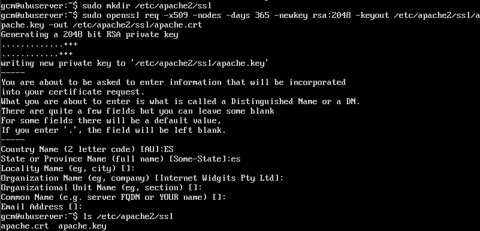

A continuación debe activarse SSL en Apache. Por lo que empleamos las siguientes ordenes:

`a2enmod ssl`

`service apache2 restart`

Editamos el archivo de configuración de SSL del sitio:

`nano /etc/apache2/sites-available/default-ssl.conf`

Y añadimos las siguientes líneas: 

```
SSLCertificateFile /etc/apache2/ssl/apache.crt
SSLCertificateKeyFile /etc/apache2/ssl/apache.key
```
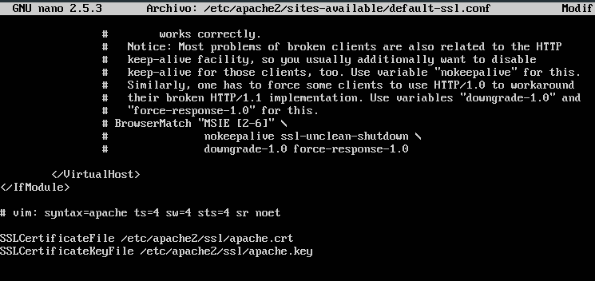

Activamos el sito default-ssl y reiniciamos apache:

`a2ensite default-ssl`

`service apache2 reload`

Para comprobar la correcta instalación, haremos una **petición curl HTTPS**

`curl -k https://<ip>`

En nuestro escenario:
* El equipo 192.168.56.11 tiene HTTPS activo
* El equipo 192.168.56.10 no tiene HTTPS activo

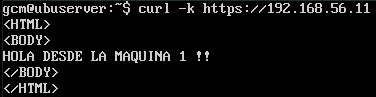

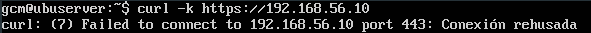

Para solucionarlo se debe copiar la clave generada anteriormente al otro servidor y activar SSL.

La copia de las claves se realiza mediante rsync. En la máquina que desea recibir los certificados ejecutamos:

`rsync -avz -e ssh <ip>:/etc/apache2/ssl/* /etc/apache2/ssl/`

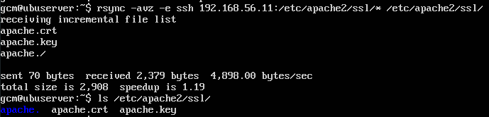

Repetimos el proceso con el archivo */etc/apache2/sites-available/default-ssl.conf* 

`rsync -avz -e ssh <ip>:/etc/apache2/sites-available/default-ssl.conf /etc/apache2/sites-available/`

Activamos SSL como se indicaba anteriormente y comprobamos que funciona correctamente.

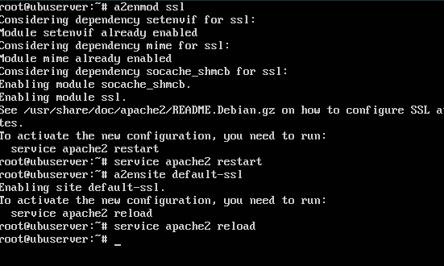

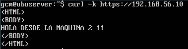

En ambos servidores queda configurado correctamente SSL.


#### SSL en Nginx

El siguiente paso es activar https en Nginx. Para ello debemos copiar el certificado SSL generado anteriormente al balanceador. 

`rsync -avz -e ssh <user>@<ip_origen>:/etc/apache2/ssl/* /etc/ssl/`

Editamos el archivo de configuración de Nginx: 

`nano /etc/nginx/sites-available/default`

Quedando como sigue:

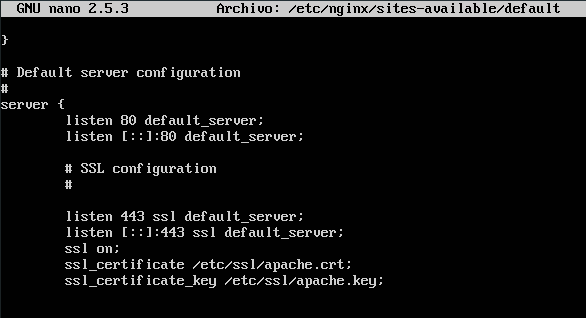

Finalmente reiniciamos el servicio ( `service nginx restart`) y comprobamos que funciona correctamente.

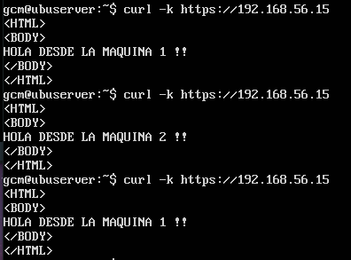

---
## Configurar cortafuegos con IPTABLES

A continuación se muestra como configurar el cortafuegos en una de las máquinas servidoras finales (en mi caso la máquina con IP 192.168.56.10).

Para llevarlo a cabo, se definen reglas en iptables para bloquear el tráfico en general y a continuación permitir aquel que nosotros definamos. El script es similar al mostrado en el guión de prácticas, y además se mostrará el resultado tras ir aplicando estas reglas.

```bash
# (1) Eliminar todas las reglas (configuración limpia)
iptables -F
iptables -X
iptables -Z
iptables -t nat -F
# (2) Política por defecto: denegar todo el tráfico
iptables -P INPUT DROP
iptables -P OUTPUT DROP
iptables -P FORWARD DROP
# (3) Permitir cualquier acceso desde localhost (interface lo)
iptables -A INPUT -i lo -j ACCEPT
iptables -A OUTPUT -o lo -j ACCEPT
# (4) Abrir el puerto 22 para permitir el acceso por SSH
iptables -A INPUT -p tcp --dport 22 -j ACCEPT
iptables -A OUTPUT -p tcp --sport 22 -j ACCEPT
# (5) Abrir los puertos HTTP (80) de servidor web
iptables -A INPUT -p tcp --dport 80 -j ACCEPT
iptables -A OUTPUT -p tcp --sport 80 -j ACCEPT
# (6) Abrir los puertos HTTPS (443) de servidor web
iptables -A INPUT -p tcp --dport 443 -j ACCEPT
iptables -A OUTPUT -p tcp --sport 443 -j ACCEPT
```

El primer paso es bloquear todo el tráfico y permitirlo a través de localhost **(1), (2) y (3)**. Al intentar conectar por SSH o hacer una petición curl, se obtiene el siguiente resultado.  

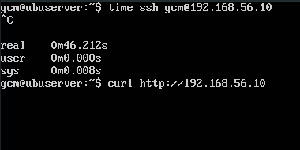

Si aplicamos las reglas **(4) y (5)** logramos que SSH funcione y se podrá acceder por HTTP, pero no por HTTPS.

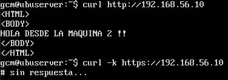

Aplicando la regla **(6)** conseguimos que se pueda acceder mediante HTTPS como se observa a continuación.

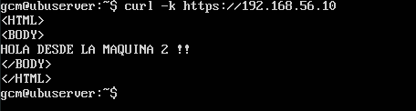

Ejecutando `netstat -tulpn` comprobamos que los puertos verdaderamente están escuchando.

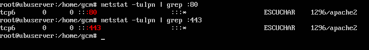

Como se observa, iptables **queda correctamente configurado**. Por lo tanto, debemos ejecutar el script al inicio del sistema para aplicar las nuevas reglas descritas.

Existen numerosas opciones para realizar la labor. En mi caso emplearé el archivo */etc/rc.local*. Basta con añadir la siguiente línea para que se ejecute en el inicio del sistema:

`sh /path/to/script.sh`

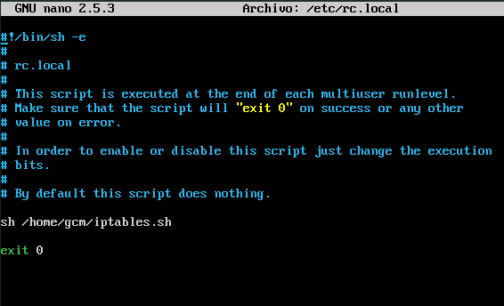

Finalmente, comprobamos si se aplican las reglas descritas. Para comprobarlo, el tráfico HTTPS será bloqueado en primera instancia, y a continuación, una vez comprobada la correcta aplicación al inicio del sistema, se permitirá.

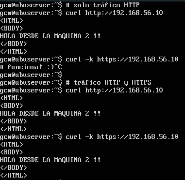

El cortafuegos en la máquina queda correctamente configurado.


### Máquina 4 como cortafuegos

Se ha creado una nueva máquina (con IP 192.168.56.20) que actuará como cortafuegos, redirigiendo al balanceador únicamente los paquetes dirigidos a los puertos 80 (HTTP) y 443 (HTTPS). Se deben establecer las siguientes reglas:

```bash
# (1) Eliminar todas las reglas (configuración limpia)
iptables -F
iptables -X
iptables -Z
iptables -t nat -F

#(2) Redireccionar HTTP y HTTPS
iptables -t nat -A PREROUTING -p tcp --dport 80 -j DNAT --to <ip_balanceador>
iptables -t nat -A PREROUTING -p tcp --dport 443 -j DNAT --to <ip_balanceador>
iptables -A FORWARD -d <ip_balanceador> -p tcp --dport 80 -j ACCEPT
iptables -A FORWARD -d <ip_balanceador> -p tcp --dport 443 -j ACCEPT

#(3) Permitir IP forwarding
sysctl net.ipv4.ip_forward=1
```

Tras la ejecución del script, las peticiones HTTP y HTTPS al cortafuegos son redirigidas al balanceador correctamente:

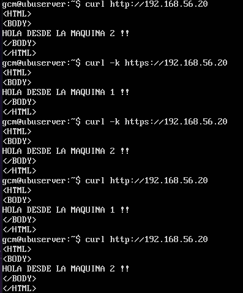

## Certbot

El siguiente extracto procede de una práctica de TDRC (también realizada por mí) sobre la instalación de un servidor XMPP  que emplea comunicación segura con SSL/TSL.

Para la gestión de certificados se usará Certbot (https://certbot.eff.org). Se trata de una herramienta desarrollada por la EFF (Electronic Frontier Foundation) para gestionar de forma automatica certificados TLS/SSL generados por Let’s Encrypt. 

El primer paso es instalar el cliente como se indica en la página web, dependiendo del sistema empleado. 

Una vez instalado, debe generarse un nuevo certificado para cada uno de los dominios a utilizar. En nuestro caso son galerarivera.duckdns.org y sanchezmolina.duckdns.org.

Antes de generar los certificados, el router debe redirigir el tráfico en el puerto 80 (HTTP) al servidor. Hay que asegurarse de que el puerto se encuentra abierto.

Para hacerlo, ejecutar como root:

`certbot certonly --standalone`

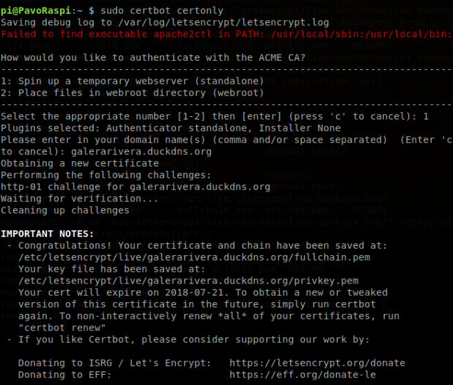

Los certificados generados quedan en la carpeta **/etc/letsencrypt/live/dominio_registrado/**

Finalmente, hay que editar el archivo de configuración del servidor y establecer las rutas del certificado y clave:

```
certificate = "/etc/letsencrypt/live/dominio_registrado/fullchain.pem";
key = "/etc/letsencrypt/live/dominio_registrado/privkey.pem";
```

----
[Práctica 5](../practica5/practica5.md)