# Práctica 5. Replicación de bases de datos MySQL

*En esta práctica el objetivo es configurar las máquinas virtuales para trabajar de forma
que se mantenga actualizada la información en una BD entre dos servidores (la
máquina secundaria mantendrá siempre actualizada la información que hay en la
máquina servidora principal).
Hay que llevar a cabo las siguientes tareas obligatorias:*
1. *Crear una BD con al menos una tabla y algunos datos.*
2. *Realizar la copia de seguridad de la BD completa usando mysqldump en la
máquina principal y copiar el archivo de copia de seguridad a la máquina
secundaria.*
3. *Restaurar dicha copia de seguridad en la segunda máquina (clonado manual
de la BD), de forma que en ambas máquinas esté esa BD de forma idéntica.*
4. *Realizar la configuración maestro-esclavo de los servidores MySQL para que la
replicación de datos se realice automáticamente.*

*Adicionalmente, y como tarea opcional para conseguir una mayor nota en esta
práctica, se propone realizar la configuración maestro-maestro entre las dos máquinas
de bases de datos.*

*Como resultado de la práctica 5 se mostrará al profesor el funcionamiento del
proceso de clonado automático de la información entre bases de datos MySQL en las
máquinas principal y secundaria (configuración maestro-esclavo y/o maestro-maestro,
en su caso). En el documento de texto a entregar se describirá en detalle cómo se ha
realizado la configuración de ambos servidores (configuraciones y comandos de
terminal ejecutados en cada momento).*

----

## Creando una Base de Datos

El primer paso es instalar mysql en el sistema. Si no se encuentra instalado

`sudo apt install mysql-server`

Para acceder a mysql se emplea:

`mysql -u root -p`

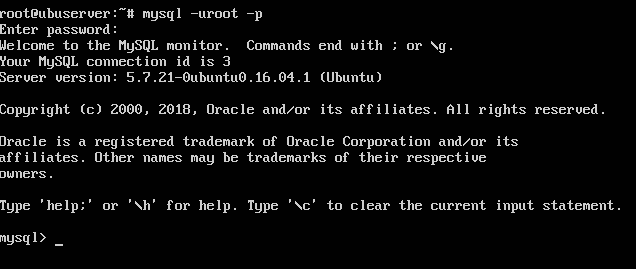

A continuación debe crearse la nueva base de datos *tienda*, dentro de esta la tabla *productos* que constará de los campos nombre y precio, y añadir algunas líneas de prueba.

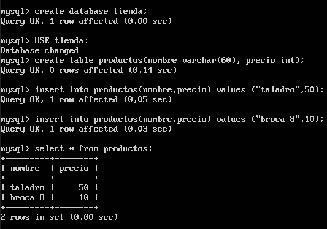

---

## Copia de seguridad y restauración

#### Copia de seguridad

Mysql ofrece una herramienta para exportar las bases de datos existentes en nuestra máquina. Se trata de **mysqldump**. Su sintaxis es la siguiente:

`mysqldump <db> -u root -p > /output/path/name.sql`

Antes de exportar la base de datos, **debe ejecutarse** las siguientes sentencias en mysql para evitar su modificación durante el proceso:

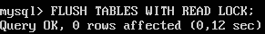

A continuación se exporta la base de datos correspondiente.


Y se vuelve a desbloquear con la siguiente sentencia:

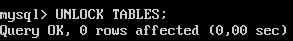

#### Restauración en otra máquina

El siguiente paso es replicar la base de datos exportada en una máquina secundaria que actuará como esclavo. 

**Atención: los comandos mostrados a continuación son ejecutados en la segunda máquina**

Para llevar a cabo la restauración, **la máquina secundaria debe tener creada la base de datos** correspondiente. En mi caso esta DB es *tienda*.

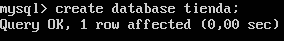

A continuación se recibe de la máquina principal el archivo exportado anteriormente mediante scp.

`scp ip_principal:/dir/remoto/nombre.sql /dir/local`

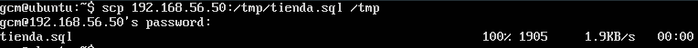

Y finalmente importamos la copia de seguridad a mysql:

`mysql -u root -p tienda < /tmp/tienda.sql`

Para comprobar que, efectivamente, la base de datos ha sido importada con éxito, se procede a listar las columnas de la tabla *productos* de la base de datos *tienda*

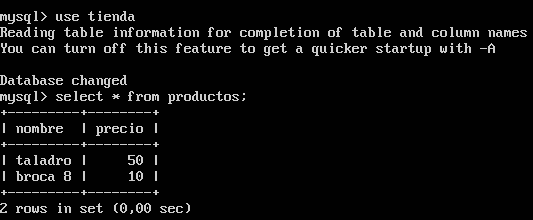

Este proceso puede resultar tedioso si debe ejecutarse a menudo. Mysql también ofrece la posibilidad de configurar una máquina como maestro y otra como esclavo, que replicará todo aquello que se modifique en la máquina maestro.

----

## Configuración maestro-esclavo

La configuración maestro-esclavo resulta muy útil en un entorno de producción real, donde los datos deben ser redundados de forma inmediata. A continuación se detallan los pasos para realizar esta configuración correctamente.

*Nota: la configuración puede variar según la distribución empleada y la versión de mysql. El guión ha sido realizado en Ubuntu 16.04 y mysql 5.7*

#### Configurar Maestro (Master)

La máquina que actuará como Master tiene la **IP 192.168.56.50**

El primer paso es editar el archivo de configuración */etc/mysql/mysql.conf.d/mysqld.cnf* cambiando o descomentando las siguientes líneas

```
bind-address = 192.168.56.50
server-id = 1
log-bin = /var/log/mysql/mysql-bin.log
```

Y reiniciar el servicio para que se hagan efectivas.

`sudo systemctl restart mysql`

Finalmente debe crearse un nuevo usuario que actuará como esclavo y anotar el archivo y posición que se muestra en la tabla del final de la imágen, ya que será usado en la configuración del esclavo.

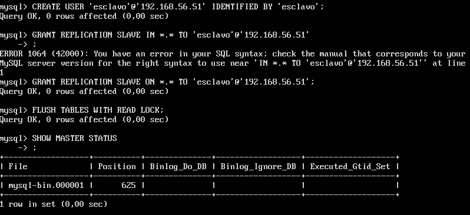


#### Configurar Esclavo (Slave)

La máquina que actuará como Master tiene la **IP 192.168.56.51**

**En el caso de estar trabajando con virtualbox y haber clonado la máquina esclavo a partir de la maestro, el archivo */var/lib/mysql/auto.cnf* debe eliminarse para evitar errores con el UUID **

El primer paso es editar el archivo de configuración */etc/mysql/mysql.conf.d/mysqld.cnf* cambiando o descomentando las siguientes líneas

```
bind-address = 192.168.56.51
server-id = 2
log-bin = /var/log/mysql/mysql-bin.log
```

Y reiniciar el servicio para que se hagan efectivas.

`sudo systemctl restart mysql`

Finalmente, hay que configurar slave para que pueda comunicarse con master. Para ello se accede al CLI de mysql (*mysql -u root -p*) y configurarlo como se describe a continuación.

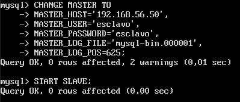

Para comprobar el estado del esclavo se emplea:
`mysql> SHOW SLAVE STATUS\G`

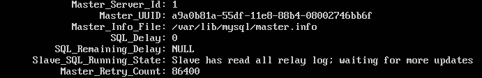

Finalmente, para ver que realmente funciona, se introducirán nuevos productos en el maestro, y el esclavo deberá mostrarlos también.

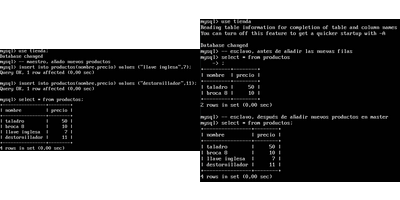

¡Bien! La configuración maestro-esclavo ha sido realizada de forma satisfactoria como muestra la anterior captura.


